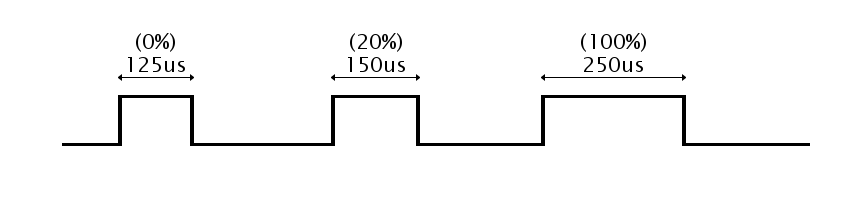

# OneShot125
En este repositorio encontrarás diferentes implementaciones del protocolo OneShot125 para control de Brushless más rapidamente.

## ¿Qué es OneShot125?

En comparación con el protocolo PWM estandar de control de Brushless basado en pulsos de 20ms, este protocolo está basado en pulsos 8 veces más rapidos de tan solo 250us. Gracias a este protocolo PWM de 4kHz, es posible ejecutar el PID sobre los motores mucho más rápido por lo que se mejora enormemente el control sobre los motores.

Tal y como se aprecia en la imagen superior, los pulsos de PWM con OneShot125 tardan un total de 250us. Para indicarle al ESC que debe detener el Brushless, el PWM debe de estar al 50% de su ciclo, o lo que viene siendo 125us de cada 250us. Y para indicarle al ESC que debe poner el Brushless a su máxima velocidad, el PWM debe de estar al 100% de su ciclo, lo que viene siendo 250us.
